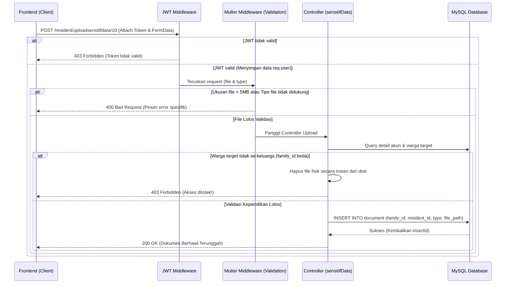

# 💌 Surat Cinta Tertulus Dari Backend (API Integration Guide)

Dokumentasi API lengkap, terstruktur, dan siap pakai untuk integrasi Frontend.

---

## 🌐 1. Konfigurasi Dasar

* **Base URL:** `http://172.20.32.62:3333`
* **Global Headers:**
  * `Content-Type: application/json`
  * `Authorization: Bearer <token_jwt>` (Untuk semua endpoint yang membutuhkan autentikasi)
* **Aturan Rate Limiting:**
  * Route Login, Register, & Verifikasi Password: Maksimal **10 request per 15 menit**.
  * Route API Lainnya: Maksimal **200 request per 15 menit**.

---

## 🔐 2. Autentikasi & Debug Akun

### A. Login User (Semua Role)
* **Method & Route:** `POST /post/login`
* **Request Body:**
  ```json
  {
    "username": "admin_rt",
    "password": "PasswordRT123!"
  }
  ```
* **Response Skenario 1 (Login Sukses Biasa):**
  ```json
  {
    "status": "login berhasil",
    "user": {
      "id": 1,
      "username": "admin_rt",
      "role": "rt",
      "family_id": null,
      "must_change_password": 0
    },
    "token": "eyJhbGciOi..."
  }
  ```
* **Response Skenario 2 (Login Warga Baru - Wajib Ganti Password):**
  ```json
  {
    "status": "must_change_password",
    "user": {
      "id": 12,
      "username": "keluarga_5",
      "role": "warga",
      "family_id": 5,
      "must_change_password": 1
    },
    "token": "eyJhbGciOi..."
  }
  ```
  > ⚠️ **Tindakan Frontend:** Jika statusnya `"must_change_password"`, simpan token sementara, lalu paksa user menuju ke halaman **Ganti Password**.

---

### B. Pembuatan Akun Dummy (Debug Only - Tanpa Lock Role)
> Endpoint ini adalah jalur pintas bagi admin backend/frontend untuk mendaftarkan akun baru secara instan di database. Peran (`role`) dikirim secara dinamis melalui request body, bukan di-hardcode di server.
* **Method & Route:** `POST /post/debug-regist`
* **Request Body:**
  ```json
  {
    "username": "sekretaris_baru",
    "password": "PasswordSakti123!",
    "email": "sekretaris@gmail.com",
    "role": "sekertaris"
  }
  ```
  * `role`: Nilai yang diizinkan sesuai database enum: `'rt'`, `'sekertaris'`, `'bendahara'`, `'warga'`, `'admin'`. (Catatan: role sekretaris ditulis `'sekertaris'` di DB enum).
* **Response Sukses (200 OK):**
  ```json
  {
    "fieldCount": 0,
    "affectedRows": 1,
    "insertId": 3
  }
  ```

---

## 🛠️ 3. Alur Pengelolaan Data RT (Khusus Role: `rt`)

> [!IMPORTANT]
> ⚠️ **LOGIKA RELASI DATA (WAJIB DIPAHAMI FRONTEND!)** ⚠️
>
> Relasi data di database kita adalah: **Satu Rumah (`house`)** ditempati **Satu Keluarga (`family/KK`)**, dan **Satu Keluarga (`family/KK`)** berisi **Banyak Warga (`warga`)**.
>
> Saat ini terjadi bug di frontend di mana frontend memanggil `POST /admin/house` dan `POST /admin/resident` **tiap kali mendaftarkan satu individu warga**. Ini salah, karena membuat setiap warga seolah-olah jomblo yang punya rumah dan KK sendiri-sendiri!
>
> **Cara Kerja yang Benar:**
> 1. **Jika mendaftarkan warga ke dalam Keluarga yang SUDAH ADA (Anggota Keluarga Baru):**
>    - **JANGAN** buat Rumah baru (`POST /admin/house`) dan **JANGAN** buat KK baru (`POST /admin/resident`)!
>    - Langsung tembak **`POST /admin/datawarga`** menggunakan `fammilyId` dan `houseId` dari keluarga/KK yang bersangkutan (ambil dari dropdown list keluarga yang sudah ada).
> 2. **Jika mendaftarkan Keluarga yang BENAR-BENAR BARU (KK Baru & Rumah Baru):**
>    - Baru jalankan alur lengkap secara sekuensial:
>      `POST /admin/house` (Dapatkan `house_id`) ➔ `POST /admin/resident` (Dapatkan `family_id`) ➔ `POST /admin/datawarga`.

Pemasukan data harus berurutan secara sekuensial jika membuat keluarga baru karena adanya relasi Foreign Key (FK) di database.

### STEP 1 — Tambah Data Rumah (`POST /admin/house`)
* **Method & Route:** `POST /admin/house`
* **Request Body:**
  ```json
  {
    "blok": "B",
    "nomor": 15,
    "alamat": "Jl. Kamboja No. 15",
    "status": "pribadi"
  }
  ```
  * `status`: Hanya boleh `"pribadi"` atau `"kontrak"`.
* **Response Sukses (200):**
  ```json
  {
    "response": 200,
    "output": {
      "pesan": { "insertId": 3 },
      "token": null
    },
    "message": "data nya sudah terkirim"
  }
  ```
  > 📌 **Tindakan Frontend:** Simpan `insertId` (id rumah) untuk dipakai pada Step 2 dan 3.

---

### STEP 2 — Tambah Data KK (`POST /admin/resident`)
* **Method & Route:** `POST /admin/resident`
* **Request Body:**
  ```json
  {
    "noKK": "3201234567890002",
    "home": 3,
    "KepalaKeluarga": 1
  }
  ```
  * `home`: ID Rumah dari Step 1.
  * `KepalaKeluarga`: ID Warga Kepala Keluarga (dapat diisi `1` untuk inisialisasi sementara, lalu di-update nanti).
* **Response Sukses (200):**
  ```json
  {
    "response": 200,
    "output": {
      "pesan": { "insertId": 5 },
      "token": null
    },
    "message": "masuk dengan sempurna"
  }
  ```
  > 📌 **Tindakan Frontend:** Simpan `insertId` (id keluarga/family) untuk dipakai pada Step 3.

---

### STEP 3 — Tambah Anggota Keluarga Warga (`POST /admin/datawarga`)
* **Method & Route:** `POST /admin/datawarga`
* **Request Body:**
  ```json
  {
    "nik": "3201234501010002",
    "nama": "Ahmad Subarjo",
    "jenisKelamin": "Laki-laki",
    "tglLahir": "1994-05-12",
    "statusHidup": "Hidup",
    "noHp": "081298765432",
    "umur": 30,
    "fammilyId": 5,
    "houseId": 3
  }
  ```
  * `fammilyId`: ID Keluarga (Family) dari Step 2.
  * `houseId`: ID Rumah dari Step 1.
* **Response Sukses (200):**
  ```json
  {
    "response": 200,
    "output": {
      "pesan": { "insertId": 10 }
    },
    "message": "masuk dengan sempurnaaa"
  }
  ```

---

### STEP 4 — Buat Akun Warga (`POST /admin/create-account`)
> Membuat kredensial login untuk satu KK.

* **Method & Route:** `POST /admin/create-account`
* **Request Body:**
  ```json
  {
    "familyId": 5
  }
  ```
* **Response Sukses (200):**
  ```json
  {
    "response": 200,
    "output": {
      "username": "keluarga_5",
      "temporaryPassword": "xT8$2aQ9"
    },
    "message": "Akun berhasil dibuat"
  }
  ```
  > 📌 **Tindakan Frontend:** Tampilkan username dan password sementara ini ke RT agar bisa diberikan kepada Warga.

---

### STEP 5 — Review Semua Pengaduan Warga (Tabel `report`) (`GET /admin/pengaduan`)
> RT melihat daftar pengaduan warga yang masuk beserta nomor KK (tersensor).

* **Method & Route:** `GET /admin/pengaduan`
* **Headers:** `Authorization: Bearer <token_jwt_rt>`
* **Response Sukses (200):**
  ```json
  [
    {
      "id": 1,
      "family_id": 5,
      "isi": "Selokan mampet depan pos ronda",
      "jenis_pengaduan": "Fasilitas Publik",
      "status": "pending",
      "no_kk": "320xxxxxxxxxx001"
    }
  ]
  ```

---

### STEP 6 — Update Status Pengaduan (`PATCH /admin/pengaduan/:id`)
> RT menyetujui atau menolak laporan pengaduan warga.

* **Method & Route:** `PATCH /admin/pengaduan/1`
* **Headers:** `Authorization: Bearer <token_jwt_rt>`
* **Request Body:**
  ```json
  {
    "status": "disetujui"
  }
  ```
  > ⚠️ **Aturan Status:** Nilai `status` hanya boleh diisi `"pending"`, `"disetujui"`, atau `"ditolak"`.
* **Response Sukses (200):**
  ```json
  {
    "response": 200,
    "output": {
      "fieldCount": 0,
      "affectedRows": 1,
      "info": "",
      "serverStatus": 2,
      "warningStatus": 0,
      "changedRows": 1
    },
    "message": "status pengaduan berhasil diupdate"
  }
  ```

---

### STEP 7 — Review Semua Pengajuan Warga (Tabel `letter`) (`GET /admin/pengajuan`)
> RT melihat daftar pengajuan surat warga yang masuk beserta nomor KK (tersensor).

* **Method & Route:** `GET /admin/pengajuan`
* **Headers:** `Authorization: Bearer <token_jwt_rt>`
* **Response Sukses (200):**
  ```json
  [
    {
      "id": 1,
      "family_id": 5,
      "keperluan": "Bikin KTP Baru",
      "jenis": "Administrasi",
      "status": "pending",
      "no_kk": "320xxxxxxxxxx001"
    }
  ]
  ```

---

### STEP 8 — Update Status Pengajuan (`PATCH /admin/pengajuan/:id`)
> RT menyetujui atau menolak laporan pengajuan warga.

* **Method & Route:** `PATCH /admin/pengajuan/1`
* **Headers:** `Authorization: Bearer <token_jwt_rt>`
* **Request Body:**
  ```json
  {
    "status": "disetujui"
  }
  ```
  > ⚠️ **Aturan Status:** Nilai `status` hanya boleh diisi `"pending"`, `"disetujui"`, atau `"ditolak"`.
* **Response Sukses (200):**
  ```json
  {
    "response": 200,
    "output": {
      "fieldCount": 0,
      "affectedRows": 1,
      "info": "",
      "serverStatus": 2,
      "warningStatus": 0,
      "changedRows": 1
    },
    "message": "status pengajuan berhasil diupdate"
  }
  ```

---

### STEP 7 — Mengelola Pengumuman RT (`/admin/announcement`)
> RT dapat membuat, mengubah, menghapus, atau melihat pengumuman untuk warga.

#### A. Membuat Pengumuman (`POST /admin/announcement`)
* **Headers:** `Authorization: Bearer <token_jwt_rt>`
* **Request Body:**
  ```json
  {
    "judul": "Gotong Royong",
    "isi": "Ayo bersihkan lingkungan hari Minggu besok jam 08.00 WIB."
  }
  ```
* **Response Sukses (200):**
  ```json
  {
    "response": 200,
    "output": {
      "pesan": {
        "affectedRows": 1,
        "insertId": 1
      }
    },
    "message": "pengumuman berhasil dibuat masbro"
  }
  ```

#### B. Mengubah Pengumuman (`PATCH /admin/announcement/:id`)
* **Headers:** `Authorization: Bearer <token_jwt_rt>`
* **Request Body (Bisa kirim judul/isi saja):**
  ```json
  {
    "isi": "Ralat jam: Mulai jam 09.00 WIB."
  }
  ```
* **Response Sukses (200):**
  ```json
  {
    "response": 200,
    "output": {
      "pesan": {
        "affectedRows": 1
      }
    },
    "message": "pengumuman berhasil diperbarui masbro"
  }
  ```

#### C. Menghapus Pengumuman (`DELETE /admin/announcement/:id`)
* **Headers:** `Authorization: Bearer <token_jwt_rt>`
* **Response Sukses (200):**
  ```json
  {
    "response": 200,
    "output": {
      "pesan": {
        "affectedRows": 1
      }
    },
    "message": "pengumuman berhasil dihapus masbro"
  }
  ```

#### D. Melihat Pengumuman (Sebagai RT) (`GET /admin/announcement`)
* **Headers:** `Authorization: Bearer <token_jwt_rt>`
* **Response Sukses (200):**
  ```json
  [
    {
      "id": 1,
      "judul": "Gotong Royong",
      "isi": "Ralat jam: Mulai jam 09.00 WIB."
    }
  ]
  ```

---

### STEP 9 — Verifikasi Pendaftaran Warga Mandiri (RT Only)
> RT melihat daftar warga baru yang didaftarkan secara mandiri oleh warga (status pending) dan melakukan verifikasi.

#### A. Melihat Daftar Pending (`GET /admin/pending-warga`)
* **Headers:** `Authorization: Bearer <token_jwt_rt>`
* **Response Sukses (200):**
  ```json
  [
    {
      "warga_id": 15,
      "nik": "320xxxxxxxxxx012",
      "nama": "Siti Aminah",
      "jenis_kelamin": "Perempuan",
      "tgl_lahir": "1998-07-20",
      "status_hidup": "Hidup",
      "no_hp": "08122334455",
      "umur": 28,
      "family_id": 5,
      "family_nokk": "320xxxxxxxxxx001",
      "house_id": 3,
      "house_blok": "A",
      "house_nomor": "12",
      "house_alamat": "Jl. Melati No. 12",
      "status": "pending"
    }
  ]
  ```

#### B. Menyetujui / Menolak Warga Baru (`PATCH /admin/pending-warga/:id`)
* **Headers:** `Authorization: Bearer <token_jwt_rt>`
* **Request Body:**
  ```json
  {
    "status": "diterima"
  }
  ```
  > ⚠️ **Aturan Status:** Nilai `status` hanya boleh diisi `"diterima"` atau `"ditolak"`.
* **Response Sukses (200):**
  ```json
  {
    "response": 200,
    "output": {
      "pesan": {
        "affectedRows": 1
      }
    },
    "message": "verifikasi status warga berhasil diupdate"
  }
  ```

---

## 🔒 4. Verifikasi & Buka Kunci Data Sensitif (Sudo Mode)

Data `nik` dan `no_kk` yang dikembalikan dari API `/admin/resident` dan `/admin/datawarga` secara bawaan disensor (**masking**) dengan karakter `x`. Untuk melihat data lengkapnya, RT harus memasukkan password kembali.

### A. Reveal NIK Warga
* **Method & Route:** `POST /admin/reveal-warga/:id_warga`
* **Request Body:**
  ```json
  {
    "password": "password_rt_yang_sedang_login"
  }
  ```
* **Response Sukses (200):**
  ```json
  {
    "nik": "3201234501010002"
  }
  ```

### B. Reveal No KK Keluarga
* **Method & Route:** `POST /admin/reveal-resident/:id_family`
* **Request Body:**
  ```json
  {
    "password": "password_rt_yang_sedang_login"
  }
  ```
* **Response Sukses (200):**
  ```json
  {
    "no_kk": "3201234567890002"
  }
  ```

---

## 👥 5. Fitur & Endpoint Warga (Role: `warga`)

### A. Ganti Password Pertama Kali (Wajib)
* **Method & Route:** `PATCH /resident/password`
* **Headers:** `Authorization: Bearer <token_jwt_sementara>`
* **Request Body:**
  ```json
  {
    "newPassword": "PasswordBaruWarga123!"
  }
  ```
* **Response Sukses (200):**
  ```json
  {
    "pesan": "Password berhasil diperbarui masbro!"
  }
  ```

### B. Ambil Data Anggota Keluarga
* **Method & Route:** `GET /resident/getmyfamily/:id_family`
* **Headers:** `Authorization: Bearer <token_jwt_warga>`
* **Response Sukses (200):**
  ```json
  [
    {
      "warga_id": 10,
      "nik": "320xxxxxxxxxx002",
      "nama": "Ahmad Subarjo",
      "jenis_kelamin": "Laki-laki",
      "tgl_lahir": "1994-05-12",
      "status_hidup": "Hidup",
      "no_hp": "081298765432",
      "umur": 30,
      "family_id": 5,
      "house_id": 3,
      "house_blok": "B",
      "house_nomor": "15",
      "house_alamat": "Jl. Kamboja No. 15",
      "house_status": "pribadi"
    }
  ]
  ```
  > 🛡️ **Proteksi Keamanan:** Warga biasa hanya diizinkan memanggil endpoint ini jika `:id_family` sesuai dengan `family_id` milik akunnya sendiri. Jika berbeda, backend mengembalikan status **`403 Forbidden`** (Akses ditolak).

### C. Buat Pengaduan Warga (Tabel `report`)
* **Method & Route:** `POST /resident/pengaduan`
* **Headers:** `Authorization: Bearer <token_jwt_warga>`
* **Request Body:**
  ```json
  {
    "isi": "Selokan mampet depan pos ronda",
    "jenis_pengaduan": "Fasilitas Publik"
  }
  ```
* **Response Sukses (200):**
  ```json
  {
    "response": 200,
    "output": {
      "fieldCount": 0,
      "affectedRows": 1,
      "insertId": 1
    },
    "message": "pengaduan berhasil terkirim"
  }
  ```
  > 📌 **Catatan:** Kolom `status` otomatis di-set `'pending'` secara bawaan di database.

### D. Cek Status Pengaduan Warga
> Warga mengambil riwayat pengaduan milik keluarganya untuk melihat apakah sudah di-approve atau belum.

* **Method & Route:** `GET /resident/pengaduan`
* **Headers:** `Authorization: Bearer <token_jwt_warga>`
* **Response Sukses (200):**
  ```json
  [
    {
      "id": 1,
      "family_id": 5,
      "isi": "Selokan mampet depan pos ronda",
      "jenis_pengaduan": "Fasilitas Publik",
      "status": "pending"
    }
  ]
  ```

### E. Buat Pengajuan Warga (Tabel `letter`)
* **Method & Route:** `POST /resident/pengajuan`
* **Headers:** `Authorization: Bearer <token_jwt_warga>`
* **Request Body:**
  ```json
  {
    "keperluan": "Bikin KTP Baru",
    "jenis": "Administrasi"
  }
  ```
* **Response Sukses (200):**
  ```json
  {
    "response": 200,
    "output": {
      "fieldCount": 0,
      "affectedRows": 1,
      "insertId": 1
    },
    "message": "pengajuan berhasil dikirim"
  }
  ```

### F. Cek Status Pengajuan Warga
> Warga mengambil riwayat pengajuan surat milik keluarganya.

* **Method & Route:** `GET /resident/pengajuan`
* **Headers:** `Authorization: Bearer <token_jwt_warga>`
* **Response Sukses (200):**
  ```json
  [
    {
      "id": 1,
      "family_id": 5,
      "keperluan": "Bikin KTP Baru",
      "jenis": "Administrasi",
      "status": "pending"
    }
  ]
  ```

### E. Melihat Pengumuman Warga (`GET /resident/announcement`)
> Warga dapat melihat pengumuman yang dikirim oleh RT.

* **Headers:** `Authorization: Bearer <token_jwt_warga>`
* **Response Sukses (200):**
  ```json
  [
    {
      "id": 1,
      "judul": "Gotong Royong",
      "isi": "Ralat jam: Mulai jam 09.00 WIB."
    }
  ]
  ```

### H. Pendaftaran Anggota Keluarga Mandiri (Tabel `warga` - Langsung Aktif)
> Warga mendaftarkan anggota keluarga baru secara mandiri. Data langsung terdaftar resmi dan berstatus aktif (diterima) tanpa menunggu verifikasi/persetujuan dari RT.
>
> 🔒 **Keamanan:** `family_id` dan `house_id` tidak perlu dikirim di request body. Backend otomatis mengambil dari KK warga yang login untuk mencegah kecurangan.

* **Method & Route:** `POST /resident/datawarga`
* **Headers:** `Authorization: Bearer <token_jwt_warga>`
* **Request Body:**
  ```json
  {
    "nik": "3201234567890012",
    "nama": "Siti Aminah",
    "jenisKelamin": "Perempuan",
    "tglLahir": "1998-07-20",
    "statusHidup": "Hidup",
    "noHp": "08122334455",
    "umur": 28
  }
  ```
* **Response Sukses (200):**
  ```json
  {
    "response": 200,
    "output": {
      "pesan": {
        "fieldCount": 0,
        "affectedRows": 1,
        "insertId": 15
      },
      "token": null
    },
    "message": "pendaftaran anggota keluarga berhasil, data langsung aktif masbro!"
  }
  ```

---

## 🔑 6. Sistem Otorisasi RBAC (Role-Based Access Control) & Akun Staff

> [!IMPORTANT]
> ⚠️ **KONSEP KEDAULATAN PERAN (SANGAT KRUSIAL BAGI FRONTEND!)** ⚠️
>
> Sistem kita tidak menggunakan pengecekan manual yang rentan di tiap controller. Kita menerapkan middleware `checkRoles` terpusat untuk memisahkan tugas pengurus RT dan warga secara tegas:
>
> 1. **Peran Ketua RT (`rt`)**:
>    * Otoritas tertinggi untuk verifikasi data, melihat reveal data KTP/KK, dan mendaftarkan akun.
>    * **Penting**: RT **TIDAK BISA** mengisi atau mengelola catatan kas/keuangan secara langsung (ini tugas eksklusif Bendahara).
> 2. **Peran Sekretaris (`sekertaris`)**:
>    * Membantu RT mengelola administrasi: mengulas/menyetujui pengaduan warga, pengajuan surat pengantar, dan daftar pending pendaftaran warga mandiri.
>    * Sekretaris **BISA** memperbarui data warga (misalnya merubah status menjadi "Meninggal").
> 3. **Peran Bendahara (`bendahara`)**:
>    * Pengelola tunggal sistem keuangan RT. Hanya Bendahara yang diizinkan menulis pengeluaran kas, iuran warga, dan surplus/defisit anggaran.
>    * Bendahara **DIBLOKIR** dari mengakses data sensitif kependudukan (tidak bisa mengintip NIK, tidak bisa mengubah status warga).
> 4. **Peran Warga (`warga`)**:
>    * Anggota keluarga biasa. Hanya bisa melihat data keluarganya sendiri, melakukan pembayaran iuran pribadi, membuat pengajuan/pengaduan, dan memperbarui data warga di bawah kartu keluarganya sendiri (tidak boleh merubah data keluarga tetangga).

### A. RT Mendaftarkan Akun Staff (Sekretaris / Bendahara)
Ketua RT membuatkan akun untuk staff pengurus RT baru. Akun ini tidak terikat dengan `family_id` karena bersifat akun kepengurusan publik.

* **Method & Route:** `POST /admin/create-staff-account`
* **Headers:** `Authorization: Bearer <token_jwt_rt>`
* **Request Body:**
  ```json
  {
    "username": "bendahara_rt02",
    "password": "PasswordBendahara123!",
    "email": "bendahara@gmail.com",
    "role": "bendahara"
  }
  ```
  * `role`: Harus bernilai antara `"sekertaris"` (atau `"sekretaris"`) atau `"bendahara"`.
* **Response Sukses (200 OK):**
  ```json
  {
    "response": 200,
    "output": {
      "pesan": {
        "username": "bendahara_rt02"
      },
      "token": null
    },
    "message": "Akun staff berhasil dibuat masbro"
  }
  ```

---

### B. Pembaruan Data Warga (Update Profil / Meninggal)
Mengubah rincian data diri warga (misalnya mengganti nama, nomor HP, atau mengubah status hidup menjadi `"Meninggal"`).

* **Method & Route:** `PATCH /resident/warga/:id_warga`
* **Headers:** `Authorization: Bearer <token_jwt_user>`
* **Request Params:**
  * `:id_warga`: ID unik warga yang ingin diperbarui (tipe: `Integer`).
* **Request Body (Kirim kolom yang ingin diubah saja - Opsional):**
  ```json
  {
    "nama": "Ahmad Subarjo Bin Slamet",
    "statusHidup": "Meninggal",
    "noHp": "081298765000",
    "umur": 31
  }
  ```
  * `statusHidup`: Bernilai `"Hidup"` atau `"Meninggal"`.
* **Response Sukses (200 OK):**
  ```json
  {
    "response": 200,
    "output": {
      "pesan": {
        "fieldCount": 0,
        "affectedRows": 1,
        "info": "",
        "serverStatus": 2,
        "warningStatus": 0,
        "changedRows": 1
      },
      "token": null
    },
    "message": "Data warga berhasil diperbarui cuy!"
  }
  ```
* **Response Error Otorisasi (403 Forbidden):**
  * *Kasus 1: Akun Bendahara mencoba merubah data warga:*
    ```json
    {
      "pesan": "Akses ditolak, bendahara tidak diizinkan mengubah data warga!"
    }
    ```
  * *Kasus 2: Akun warga biasa mencoba merubah warga dari keluarga/KK lain:*
    ```json
    {
      "pesan": "Akses ditolak, ini bukan data keluarga lu cuy!"
    }
    ```

---

---

## 📁 7. Fitur Upload & Download Dokumen Sensitif (Multer & JWT Protection)

> [!IMPORTANT]
> ⚠️ **DESAIN ARSITEKTUR & KEAMANAN DATA SENSITIF (WAJIB DIPAHAMI FRONTEND SEBELUM DEPLOY!)** ⚠️
>
> 🚀 **Mengapa Harus Didesain Seperti Ini?**
>
> * **Zero Public Exposure (Tidak Bocor)**: Kita menaruh folder penyimpanan file (`secure_uploads/`) di root project, yang berada **di luar folder statis publik Express**. File-file di sini tidak terindeks oleh mesin pencari (SEO) dan tidak bisa diakses langsung via URL statis browser (misalnya: `http://localhost:3333/secure_uploads/ktp.png` akan menghasilkan `404 Not Found`).
> * **Tabel Database `document` yang Terpisah**: Berbeda dengan implementasi malas di mana file disimpan sebagai string kolom di dalam tabel `warga`, kita menggunakan tabel tersendiri (`document`) dengan relasi `family_id` dan `resident_id`. Ini mematuhi prinsip normalisasi database (2NF/3NF) sehingga satu warga bisa memiliki banyak dokumen sekaligus (seperti KTP, KK, Akta, KIA) tanpa redundansi data.
> * **Sistem Otorisasi Multi-Level (Family-Gate & JWT Guard)**:
>   * **Garda JWT**: Semua endpoint ini diproteksi oleh token JWT. User harus melampirkan header `Authorization: Bearer <token>`.
>   * **Pencocokan ID Family**: Sistem akan membandingkan `family_id` milik warga target (dari request params `:id`) dengan `family_id` milik akun yang login (dari payload JWT). Jika user dari keluarga A mencoba mengupload/mengunduh file untuk warga keluarga B, request akan langsung diblokir di pintu gerbang controller dengan status `403 Forbidden`.

### Diagram Alur Upload File (Frontend ➔ Backend)


---

### A. Upload Dokumen Sensitif Warga
Mengupload berkas sensitif milik warga (KTP, KK, Akta, KIA) berdasarkan ID Warga target yang terafiliasi dengan keluarga user.

* **Method & Route:** `POST /resident/uploadsensitifdata/:id_warga`
* **Headers:** 
  * `Authorization: Bearer <token_jwt_warga>`
  * `Content-Type: multipart/form-data`
* **Request Params:**
  * `:id_warga`: ID unik warga yang akan dikaitkan dengan dokumen ini (tipe: `Integer`).
* **Request Body (Multipart Form-Data):**
  * `file`: File fisik berkas yang diupload (Maksimal **5 MB**).
    * *Format yang diizinkan:* `.jpg`, `.jpeg`, `.png`, `.pdf` (Case Insensitive).
  * `type`: String Enum nilai kategori berkas.
    * *Nilai wajib salah satu dari:* `"kk"`, `"ktp"`, `"akta"`, `"kia"`.
* **Response Sukses (200 OK):**
  ```json
  {
    "response": 200,
    "output": {
      "pesan": {
        "document_id": 14,
        "file_path": "file-1720888899123-987654321.pdf"
      },
      "token": null
    },
    "message": "Upload file sensitif berhasil masbro!"
  }
  ```

* **Respon Error Penolakan Validasi Multer (400 Bad Request):**
  * *Kasus 1: Format file dilarang (misalnya `.exe` atau `.txt`):*
    ```json
    {
      "pesan": "Format file tidak didukung masbro! Cuma boleh JPG, JPEG, PNG, dan PDF."
    }
    ```
  * *Kasus 2: Ukuran file melebihi batas batas 5 Megabytes:*
    ```json
    {
      "pesan": "File kegedean masbro, maksimal cuma boleh 5MB!"
    }
    ```

* **Respon Error Penolakan Otorisasi (403 Forbidden):**
  * *User mencoba mengupload untuk warga di luar kartu keluarganya:*
    ```json
    {
      "pesan": "Akses ditolak, ini bukan data keluarga lu cuy!"
    }
    ```

---

### B. Download / Akses Dokumen Sensitif secara Aman
Mengambil file fisik dokumen dari server menggunakan otorisasi token. Karena folder file bersifat privat, frontend tidak bisa memakai tag `` langsung ke folder. Cara yang benar adalah memanggil endpoint ini untuk mendapatkan stream biner.

* **Method & Route:** `GET /resident/sensitifdata/file/:document_id`
* **Headers:** `Authorization: Bearer <token_jwt_warga>`
* **Request Params:**
  * `:document_id`: ID unik dokumen yang tercatat di tabel `document` (tipe: `Integer`).
* **Response Sukses (200 OK):**
  Mengirimkan stream biner dari file fisik yang disimpan di server.
  > 💡 **Panduan Integrasi Frontend:** 
  > Untuk menampilkan file berupa gambar di aplikasi web, frontend harus memanggil API ini menggunakan Axios/Fetch dengan parameter `responseType: 'blob'`, lalu mengubahnya menjadi URL lokal menggunakan `URL.createObjectURL(blobData)` untuk di-render di tag `` atau `<iframe>`.
  
  *Contoh kode Javascript di Frontend:*
  ```javascript
  const downloadKtp = async (documentId) => {
      const response = await axios.get(`http://localhost:3333/resident/sensitifdata/file/${documentId}`, {
          headers: { Authorization: `Bearer ${localStorage.getItem('token')}` },
          responseType: 'blob'
      });
      const localFileUrl = URL.createObjectURL(response.data);
      document.getElementById('ktp-preview').src = localFileUrl;
  };
  ```

* **Respon Error Penolakan Akses (403 Forbidden):**
  * *User mencoba mengakses dokumen milik keluarga lain:*
    ```json
    {
      "pesan": "Akses ditolak, ini bukan data keluarga lu cuy!"
    }
    ```

* **Respon Error File Tidak Ditemukan (404 Not Found):**
  * *Dokumen dengan ID tersebut tidak ada di database:*
    ```json
    {
      "pesan": "Dokumen tidak ditemukan, cuy!"
    }
    ```
  * *Data ada di DB, tapi file fisiknya hilang di server:*
    ```json
    {
      "pesan": "File fisik dokumen tidak ditemukan di server, masbro"
    }
    ```

---

## 🪙 8. Sistem Keuangan, IPL (Iuran Bulanan), & Uang Kas RT

Sistem keuangan kita dibagi menjadi dua jenis iuran: **IPL (bulanan tetap)** dan **Uang Kas (insidental/sosial)**. Bendahara mengelola persetujuan pembayaran dan pengeluaran kas, sedangkan Warga melakukan upload bukti transfer.

### A. Bayar Iuran IPL Warga (Support Rapel)
Warga menyetorkan pembayaran IPL bulanan. Jika membayar rapel beberapa bulan sekaligus, kirimkan daftar bulan dalam format JSON array.

* **Method & Route:** `POST /resident/pay-ipl`
* **Headers:** 
  * `Authorization: Bearer <token_jwt_warga>`
  * `Content-Type: multipart/form-data`
* **Request Body (Multipart Form-Data):**
  * `months`: Stringified JSON array bulan, contoh: `"[1, 2, 3]"` (untuk membayar Jan, Feb, Mar).
  * `year`: Tahun target, contoh: `2026` (tipe: `Integer`).
  * `amount`: Total nominal uang, contoh: `600000` (tipe: `Integer`).
  * `file`: Berkas bukti transfer (PDF/JPG/PNG, max 5MB).
* **Response Sukses (200 OK):**
  ```json
  {
    "response": 200,
    "output": {
      "message": "Pembayaran IPL pending berhasil dicatat masbro",
      "payment_ids": [10, 11, 12]
    },
    "message": "Bukti pembayaran IPL berhasil diunggah masbro, menunggu approval bendahara"
  }
  ```

---

### B. Bayar Uang Kas Warga (Insidental)
Warga menyetorkan sumbangan sosial atau iuran kegiatan tertentu.

* **Method & Route:** `POST /resident/pay-kas`
* **Headers:** 
  * `Authorization: Bearer <token_jwt_warga>`
  * `Content-Type: multipart/form-data`
* **Request Body (Multipart Form-Data):**
  * `amount`: Nominal sumbangan, contoh: `50000` (tipe: `Integer`).
  * `category`: Kategori kas. Harus berupa salah satu dari: `"kematian"`, `"sosial"`, `"kegiatan"`, `"lainnya"`.
  * `description`: Nama kegiatan/keterangan iuran, contoh: "Santunan Kematian Pak Slamet" (tipe: `String`).
  * `file`: Berkas bukti transfer.
* **Response Sukses (200 OK):**
  ```json
  {
    "response": 200,
    "output": {
      "fieldCount": 0,
      "affectedRows": 1,
      "insertId": 3
    },
    "message": "Bukti pembayaran Kas berhasil diunggah masbro, menunggu approval bendahara"
  }
  ```

---

### C. Ambil Daftar Pending Pembayaran (Khusus Bendahara & RT)
Bendahara/RT melihat daftar bukti transfer pembayaran IPL dan Kas yang baru dikirim oleh warga untuk diverifikasi.

* **Method & Route:** `GET /admin/finance/pending`
* **Headers:** `Authorization: Bearer <token_jwt_bendahara_atau_rt>`
* **Response Sukses (200 OK):**
  ```json
  {
    "response": 200,
    "output": {
      "ipl": [
        {
          "id": 10,
          "family_id": 5,
          "amount": 200000,
          "month": 1,
          "year": 2026,
          "payment_date": "2026-01-05T08:00:00.000Z",
          "status": "pending",
          "payment_proof": "file-1720888899.png",
          "no_kk": "320xxxxxxxxxx001"
        }
      ],
      "kas": [
        {
          "id": 3,
          "family_id": 5,
          "amount": 50000,
          "category": "kegiatan",
          "description": "Kerja bakti mushola",
          "payment_date": "2026-01-10T12:00:00.000Z",
          "status": "pending",
          "payment_proof": "file-172099999.png",
          "no_kk": "320xxxxxxxxxx001"
        }
      ]
    },
    "message": "Daftar pending pembayaran berhasil diambil"
  }
  ```

---

### D. Approve / Reject Pembayaran IPL (Khusus Bendahara & RT)
Bendahara menyetujui atau menolak bukti bayar IPL warga. Jika status disetel `"diterima"`, nominal masuk otomatis ke Buku Kas Ledger sebagai pemasukan (`in`).

* **Method & Route:** `PATCH /admin/finance/approve-ipl/:payment_id`
* **Request Body:**
  ```json
  {
    "status": "diterima" 
  }
  ```
  * `status`: Wajib `"diterima"` atau `"ditolak"`.
* **Response Sukses (200 OK):**
  ```json
  {
    "response": 200,
    "output": {
      "fieldCount": 0,
      "affectedRows": 1,
      "changedRows": 1
    },
    "message": "Pembayaran IPL berhasil di-set diterima masbro!"
  }
  ```

---

### E. Mencatat Pengeluaran Kas RT (Khusus Bendahara & RT)
Bendahara mencatat pengeluaran uang kas RT (misal beli sapu, bayar satpam, santunan sosial).

* **Method & Route:** `POST /admin/finance/expense`
* **Request Body:**
  ```json
  {
    "amount": 1500000,
    "sourceType": "keamanan",
    "description": "Gaji bulanan Security RT 02"
  }
  ```
  * `sourceType`: Harus berupa salah satu dari: `"kebersihan"`, `"keamanan"`, `"taman"`, `"operasional_rt"`, `"kematian"`, `"sosial"`, `"kegiatan"`, `"lainnya"`.
* **Response Sukses (200 OK):**
  ```json
  {
    "response": 200,
    "output": {
      "fieldCount": 0,
      "affectedRows": 1,
      "insertId": 24
    },
    "message": "Pengeluaran kas RT berhasil dicatat cuy!"
  }
  ```

---

### F. Dashboard Tracking Tunggakan & Iuran Warga (Khusus Bendahara & RT)
Melihat daftar seluruh KK warga dan memetakan status iurannya (Lunas, Pending Verifikasi, atau Nunggak) untuk pelacakan bulanan.

* **Method & Route:** `GET /admin/finance/tracking`
* **Query Parameters (Opsional):**
  * `month`: Bulan target (1-12), default: bulan saat ini.
  * `year`: Tahun target, default: tahun saat ini.
* **Response Sukses (200 OK):**
  ```json
  {
    "response": 200,
    "output": [
      {
        "family_id": 5,
        "no_kk": "320xxxxxxxxxx001",
        "kepala_keluarga_nama": "Budi Santoso",
        "target_bulan": "1/2026",
        "nominal_tagihan": 200000,
        "status": "Lunas"
      }
    ],
    "message": "Daftar status iuran IPL warga berhasil ditarik masbro"
  }
  ```

---

### G. Statistik Infografis Kas RT (Public / Landing Page)
Endpoint publik tanpa token JWT untuk menyajikan grafik visual statistik umum di halaman awal web RT sebelum login.

* **Method & Route:** `GET /post/dashboard-stats`
* **Response Sukses (200 OK):**
  ```json
  {
    "response": 200,
    "output": {
      "stats": {
        "total_warga": 127,
        "previous_balance": 5000000,
        "total_income": 4800000,
        "total_expense": 1800000,
        "current_balance": 8000000
      },
      "ledger": [
        {
          "id": 24,
          "type": "out",
          "amount": 1500000,
          "source_type": "keamanan",
          "description": "Gaji bulanan Security RT 02",
          "transaction_date": "2026-01-12T10:00:00.000Z"
        }
      ]
    },
    "message": "Statistik dashboard kas RT berhasil diambil masbro"
  }
  ```

---

## ⚠️ 9. Format Response Error Standar

### A. Error Validasi Parameter / Input (400)
```json
{
  "success": false,
  "errors": [
    {
      "message": "No KK minimal 5 karakter",
      "path": ["noKK"]
    }
  ]
}
```

### B. Error Autentikasi / Token Tidak Valid (403)
```json
{
  "message": "Token tidak valid"
}
```

### C. Error Akses Ditolak / Bukan Hak Milik (403)
```json
{
  "pesan": "Akses ditolak, ini bukan data keluarga lu cuy!"
}
```

